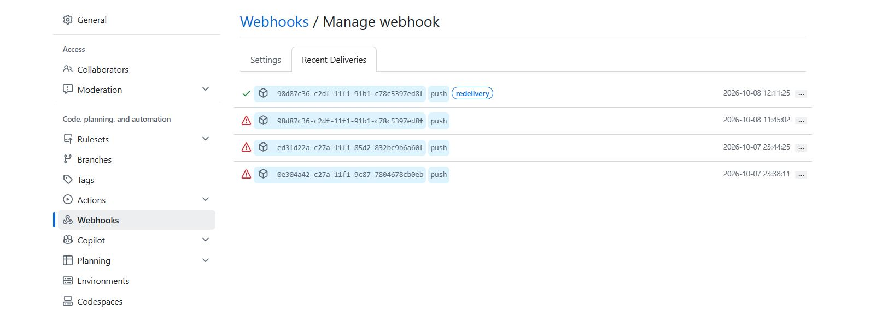

# 🚀 DevOps CI/CD Pipeline

A complete CI/CD pipeline for deploying a containerized Flask application to an AWS EC2 instance.

The project demonstrates **Infrastructure as Code with Terraform, automated testing with Pytest, containerization with Docker, CI/CD with Jenkins, reverse proxying with Nginx, and GitHub Webhooks for automatic deployments.**

---

## 🏗️ Architecture

```text
                         ┌──────────────────┐
                         │     Developer    │
                         └────────┬─────────┘
                                  │
                               git push
                                  │
                                  ▼
                         ┌──────────────────┐
                         │      GitHub      │
                         └────────┬─────────┘
                                  │
                           GitHub Webhook
                                  │
                                  ▼
                         ┌──────────────────┐
                         │      ngrok       │
                         └────────┬─────────┘
                                  │
                                  ▼
                    ┌──────────────────────────┐
                    │     Jenkins on EC2       │
                    │                          │
                    │  1. Test                 │
                    │  2. Docker Build         │
                    │  3. Deploy               │
                    │  4. Health Check         │
                    └────────────┬─────────────┘
                                 │
                                 ▼
                         ┌──────────────────┐
                         │ Docker Container │
                         │    Flask :5000   │
                         └────────┬─────────┘
                                  │
                                  ▼
Internet ───────────────► Nginx :80
                                  │
                                  ▼
                         Flask Application
```

### AWS Infrastructure

```text
Terraform
    │
    ├── VPC
    ├── Public Subnet
    ├── Internet Gateway
    ├── Route Table
    ├── Security Group
    └── EC2 Instance
             │
             ├── Jenkins
             ├── Docker
             └── Nginx
```

---

## 🔄 CI/CD Workflow

Every code push follows this workflow:

```text
Developer
   ↓
git push
   ↓
GitHub
   ↓
GitHub Webhook
   ↓
ngrok
   ↓
Jenkins
   ↓
Run Pytest
   ↓
Build Docker Image
   ↓
Deploy Container
   ↓
Health Check
   ↓
Deployment Successful
```

This allows application changes to be automatically tested and deployed without manually running the deployment steps.

---

## 🛠️ Technologies Used

| Technology      | Purpose                      |
| --------------- | ---------------------------- |
| AWS EC2         | Application and CI/CD server |
| Terraform       | Infrastructure as Code       |
| Jenkins         | CI/CD automation             |
| Docker          | Application containerization |
| Nginx           | Reverse proxy                |
| Flask           | Web application              |
| Pytest          | Automated testing            |
| GitHub          | Source code management       |
| GitHub Webhooks | CI/CD trigger                |
| ngrok           | Webhook tunneling            |
| Linux / Ubuntu  | Server environment           |

---

## ☁️ AWS Infrastructure

The AWS infrastructure is provisioned using Terraform.

### Resources

* VPC
* Public Subnet
* Internet Gateway
* Route Table
* Route Table Association
* Security Group
* EC2 Instance

### EC2 Configuration

* Ubuntu 24.04 LTS
* `t3.micro`
* Public IP enabled
* Jenkins
* Docker
* Nginx

Terraform configuration is available in:

```text
terraform/
├── main.tf
└── .terraform.lock.hcl
```

Terraform state files and provider directories are intentionally excluded from Git using `.gitignore`.

---

## 🐳 Docker

The Flask application is packaged as a Docker image.

### Build

```bash
docker build -t devops-cicd-app:1.0 .
```

### Run

```bash
docker run -d \
  --name devops-cicd-app \
  -p 5000:5000 \
  devops-cicd-app:1.0
```

The container exposes the Flask application on port `5000`.

---

## 🧪 Automated Testing

The pipeline runs automated tests before building and deploying the Docker image.

Current tests:

```text
test_app.py::test_home PASSED
test_app.py::test_health PASSED

2 passed
```

If the tests fail, the pipeline stops before deployment.

---

## 🔧 Jenkins Pipeline

The Jenkins pipeline contains four stages:

### 1. Test

Creates a Python virtual environment, installs dependencies, and runs Pytest.

### 2. Docker Build

Builds the latest Docker image:

```text
devops-cicd-app:1.0
```

### 3. Deploy

Stops and removes the previous container and starts a new container using the newly built image.

### 4. Health Check

Verifies that the application is responding successfully:

```text
curl -f http://localhost:5000/health
```

Expected response:

```text
OK
```

---

## 🌐 Nginx Reverse Proxy

Nginx is used as a reverse proxy.

```text
Internet
    ↓
EC2 :80
    ↓
Nginx
    ↓
Docker :5000
    ↓
Flask
```

The Flask application does not need to be directly exposed on port `5000` to the internet.

Users access the application through HTTP port `80`.

---

## 📸 Project Screenshots

### Application


### Jenkins Console Output


### GitHub Repository


### Jenkins Build and Webhook


### GitHub Webhook



---

## 📁 Project Structure

```text
devops-cicd-pipeline/
│
├── terraform/
│   ├── main.tf
│   └── .terraform.lock.hcl
│
├── screenshots/
│   ├── Application running.JPG
│   ├── console output.JPG
│   ├── github repository.JPG
│   ├── jenkins build 6 webhook.JPG
│   └── webhook.JPG
│
├── app.py
├── test_app.py
├── requirements.txt
├── Dockerfile
├── Jenkinsfile
├── .gitignore
└── README.md
```

---

## 🚀 Deployment Process

1. Developer modifies application code.
2. Changes are pushed to GitHub.
3. GitHub sends a webhook notification.
4. ngrok forwards the webhook to Jenkins.
5. Jenkins checks out the latest code.
6. Automated tests are executed.
7. Docker image is built.
8. Existing container is replaced.
9. New container starts.
10. Health check verifies the application.
11. Jenkins reports the pipeline result.

---

## 🎯 Project Objectives

This project was built to gain practical experience with:

* Infrastructure as Code
* AWS EC2
* Terraform
* Linux server administration
* Docker
* Jenkins
* CI/CD pipelines
* Git and GitHub
* GitHub Webhooks
* Automated testing
* Nginx reverse proxy
* Container deployment

---

## 👩‍💻 Author

**Akhila P M**

Aspiring Cloud & DevOps Engineer

**Skills:** AWS · Terraform · Docker · Jenkins · Linux · Git · CI/CD · Nginx · Python
